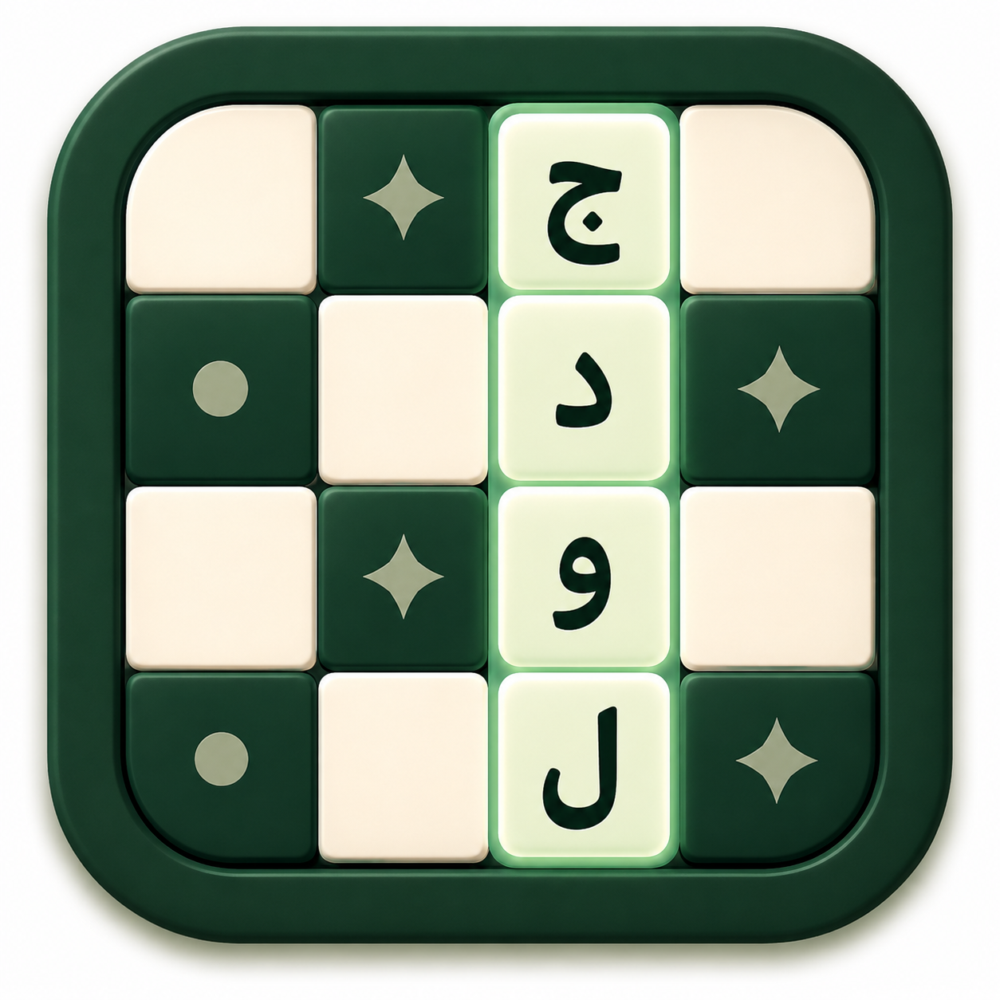

  

# جدول کلمات فارسی

این پروژه برای نگهداری و اجرای جدول‌های کلمات فارسی ساخته شده است.

برای شروع بازی، به این آدرس بروید:

[https://blankuapp.github.io/PersianCrossword/](https://blankuapp.github.io/PersianCrossword/)

تلاش می‌کنم هر از چند گاهی جدول‌های روزنامه‌هایی مثل ایران و جام جم را هم وارد این سیستم کنم تا مجموعه‌ی جدول‌ها به‌مرور کامل‌تر شود.

## همکاری

اگر مایل به همکاری هستید، ساده‌ترین مسیر این است:

1. پروژه را در VS Code باز کنید.
2. از بخش Taskها، تسک `Grid Importer: Run All` را اجرا کنید. در صورت نیاز می‌توانید `Grid Importer: Backend` و `Grid Importer: Frontend` را جداگانه هم اجرا کنید.
3. جدول موردنظر را از منبع اصلی استخراج کنید؛ مثلا خانه‌ها، شماره‌ها و سرنخ‌ها را جمع‌آوری کنید.
4. داده‌ی استخراج‌شده را به یک ابزار هوش مصنوعی بدهید تا خروجی را در قالب `JSON` مناسب این پروژه تولید کند.
5. برای هماهنگ‌کردن فرمت، فایل‌های موجود در پوشه‌ی `puzzles/` را به‌عنوان نمونه بررسی کنید.
6. در صورت نیاز، با اجرای تسک `Run App Dev Server (LAN)` یا ابزارهای پروژه، نتیجه را بررسی و اصلاح کنید.

اگر خروجی نهایی تمیز و سازگار باشد، می‌توانید آن را به پروژه اضافه کنید و برای بهبود مجموعه‌ی جدول‌ها کمک کنید.
