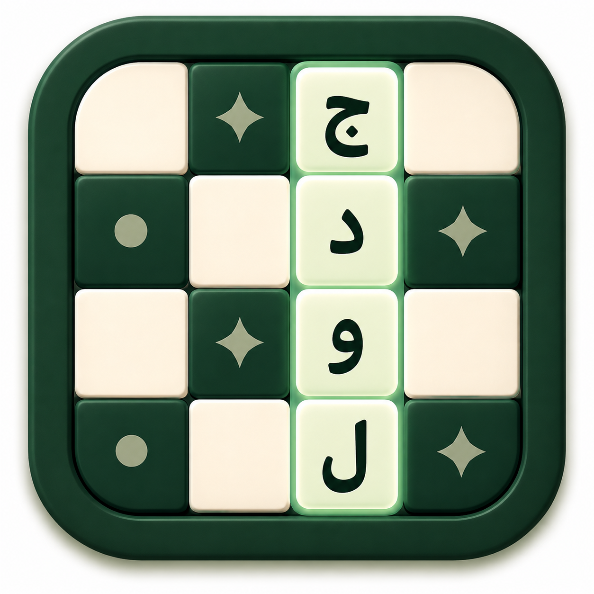

  

# جدول کلمات فارسی

این پروژه برای نگهداری و اجرای جدول‌های کلمات فارسی ساخته شده است.

برای شروع بازی، به این آدرس بروید:

[https://blankuapp.github.io/PersianCrossword/](https://blankuapp.github.io/PersianCrossword/)

تلاش می‌کنم هر از چند گاهی جدول‌های روزنامه‌هایی مثل ایران و جام جم را هم وارد این سیستم کنم تا مجموعه‌ی جدول‌ها به‌مرور کامل‌تر شود.

## وارد کردن جدول از تصویر در پنل مدیریت

پنل مدیریت سه تب دارد: «پیش‌نویس‌ها»، «ساخت با هوش‌واره» و «افزودن با JSON». تب اول فهرست پیش‌نویس‌ها را نشان می‌دهد؛ تغییر تب، تصاویر، برش‌ها و نتیجه‌های واردشده را حفظ می‌کند. راهنمای هر کنترل از آیکون کنار آن با ماوس، لمس یا صفحه‌کلید باز می‌شود.

تب فعال و تنظیمات ساخت با هوش‌واره (مدل، میزان استدلال، ابعاد، نوع و شمارهٔ جدول، شناسه، عنوان، روزنامه، سطح و طراح) خودکار در `localStorage` با کلید `persian-crossword-admin-settings` ذخیره و با باز کردن دوبارهٔ صفحه بازیابی می‌شوند. بزرگ‌نمایی و ابزار انتخاب‌شده برای هر یک از دو ویرایشگر برش هم مستقل ذخیره می‌شوند. این تنظیمات به Firebase همگام نمی‌شوند؛ کلید API در کلید جداگانهٔ خودش باقی می‌ماند. تصاویر، کادرهای وابسته به تصویر و JSON استخراج‌شده دادهٔ کار جاری‌اند و با بارگذاری مجدد باید دوباره وارد شوند. اگر ذخیرهٔ محلی ممکن نباشد، پیام خطا نمایش داده می‌شود و فرم همچنان قابل استفاده است.

حرکت تب‌ها، دیالوگ برش، راهنماها و نمایش نتیجه‌ها از الگوهای [Transitions.dev](https://transitions.dev/library.html) استفاده می‌کند؛ با تنظیم کاهش حرکت در دستگاه، این حرکت‌ها غیرفعال می‌شوند. رقم‌های انگلیسی و عربی در شمارهٔ جدول، ابعاد، مختصات و مشخصات هنگام تایپ به فارسی نمایش داده می‌شوند. ابعاد در درخواست و JSON همچنان عدد هستند؛ کلیدهای شماره‌دار JSON، کلید API و شناسهٔ مدل قالب فنی خود را دارند.

در تب هوش‌واره، تصویر پرسش‌ها و تصویر جدول پاسخ را جداگانه انتخاب کنید و «ویرایش برش‌ها در صفحهٔ بزرگ» را بزنید. ابزار برش در پنجرهٔ تمام‌صفحه، با بزرگ‌نمایی، تناسب با عرض، اندازهٔ اصلی و جابه‌جایی تصویر باز می‌شود. روی تصویر پرسش‌ها چند کادر بکشید؛ کادرها به ترتیب انتخاب از بالا به پایین در یک تصویر PNG چیده می‌شوند. با «تنظیم کادر»، کادر را جابه‌جا کنید یا گوشهٔ پایین راستش را برای تغییر اندازه بکشید. ترتیب، مختصات و اندازهٔ کادرها از فهرست هم قابل تغییر است. روی تصویر دوم یک کادر دور جدول بکشید و تعداد ردیف‌ها و ستون‌ها را وارد کنید. «پایان برش» یا Escape پنجره را می‌بندد و برش‌ها را حفظ می‌کند.

برای صفحه‌های «یک جدول با دو شرح»، نوع عادی یا ویژه و شمارهٔ جدول را انتخاب کنید و برای هر نوع یک پیش‌نویس جدا با شناسهٔ متفاوت بسازید. تغییر نوع، کادرها و نتیجه‌ها را پاک می‌کند ولی تصویرهای انتخاب‌شده باقی می‌مانند. در نمونهٔ ۸۰۵۰، پرسش‌ها در `8050.webp` هستند و پاسخ‌های همان جدول پایین سمت چپ `8051.webp` چاپ شده‌اند: پاسخ عادی در سمت راست و پاسخ ویژه در سمت چپ. پاسخ‌های پایین `8050.webp` مربوط به ۸۰۴۹ هستند. هر دو پاسخ ۱۵×۱۵ هستند؛ فقط خود شبکه را بدون شماره‌های حاشیه و نوار عنوان برش بزنید.

در نمونهٔ ۸۰۵۰، ترتیب کادرهای عادی: افقی ۱ تا ۱۵ و سپس عمودی ۱ تا ۱۵ در ستون راست. ترتیب کادرهای ویژه: افقی ۱ تا ۷ در پایین ستون راست، ادامهٔ افقی ۸ تا ۱۵ در بالای ستون میانی، عمودی ۱ و ۲ در پایین ستون میانی، سپس ادامهٔ عمودی ۳ تا ۱۵ در ستون چپ. سطرهای ادامه را کامل داخل کادر بگذارید.

استخراج هر تصویر از مرورگر و با [OpenRouter](https://openrouter.ai/docs/guides/overview/multimodal/image-understanding) انجام می‌شود. کلید API را در پنل وارد کنید؛ کلید در `localStorage` همین مرورگر با نام `persian-crossword-openrouter-key` ذخیره و هنگام باز کردن دوبارهٔ پنل بازیابی می‌شود. برای حذف کلید، فیلد آن را خالی کنید. کلید در پیش‌نویس یا JSON جدول ذخیره و به Firebase ارسال نمی‌شود. مدل پیش‌فرض `google/gemini-3.8-flash` است؛ شناسهٔ مدل را می‌توانید تغییر دهید، به شرط پشتیبانی تصویر، JSON Schema و reasoning.

درخواست از `response_format` با JSON Schema و جزئیات تصویر بالا استفاده می‌کند. میزان استدلال از کنترل «Reasoning effort» با سه سطح کم، متوسط و زیاد قابل انتخاب است؛ پیش‌فرض «زیاد» (`high`) است و مقدار انتخابی برای هر دو تصویر و استخراج دوباره ارسال می‌شود. اثر و پشتیبانی سطح‌ها به مدل بستگی دارد؛ سطح بیشتر ممکن است زمان و هزینه را افزایش دهد. [راهنمای OpenRouter](https://openrouter.ai/docs/guides/best-practices/reasoning-tokens) این تنظیم را توضیح می‌دهد. استخراج ممکن است چند دقیقه طول بکشد. دستور استخراج، متن فارسی راست‌به‌چپ، جدول روزنامه، ترتیب برش‌ها و نوع عادی/ویژه را مشخص می‌کند. نتیجهٔ پرسش‌ها در قالب مخزن، یعنی `{"clues":{"horizontal":{"1":["پرسش"]},"vertical":{"1":["پرسش"]}}}` درخواست می‌شود.

نتیجهٔ JSON پیش از ساخت پیش‌نویس قابل ویرایش است. بررسی پرسش‌ها بلافاصله قالب، شماره‌ها و تعداد گروه‌ها را نشان می‌دهد: برای جدول ۱۵×۱۵ دقیقاً گروه‌های ۱ تا ۱۵ در هر جهت لازم است؛ هر گروه می‌تواند چند پرسش داشته باشد. پس از استخراج جدول، تعداد پرسش‌های هر گروه نیز با جای واژه‌ها در شبکه بررسی می‌شود. نتیجهٔ نامعتبر ذخیره نمی‌شود؛ آن را اصلاح کنید یا «استخراج دوباره» را بزنید تا درخواست تازه‌ای با همان برش‌ها ساخته شود. طبق قالب فایل‌های مخزن، ردیف‌های جدول از بالا به پایین و خانه‌ها از راست به چپ ذخیره می‌شوند؛ خانه‌های بدون حرف با `""` و باقی خانه‌ها با یک حرف فارسی نمایش داده می‌شوند. در قالب فعلی برنامه، `""` خانهٔ سیاه است؛ برای ساخت جدول قابل حل، از تصویر پاسخ دارای حروف استفاده کنید.

خانه‌های پیش‌نمایش جدول نیز قابل ویرایش‌اند: روی خانه کلیک کنید و یک حرف فارسی بنویسید؛ خالی کردن آن خانهٔ سیاه می‌سازد. کلیدهای جهت بین خانه‌ها جابه‌جا می‌شوند. هر تغییر، JSON و بررسی هماهنگی پرسش‌ها را به‌روز می‌کند؛ حتی اگر این بررسی ناموفق باشد، شبکه برای اصلاح باقی می‌ماند. اگر خروجی نسبت به عکس آینه‌ای است، «برعکس کردن چپ و راست» ترتیب خانه‌های تمام ردیف‌ها، از جمله خانه‌های سیاه، را اصلاح می‌کند و JSON را به‌روز می‌کند؛ زدن دوبارهٔ آن تغییر را برمی‌گرداند و نیازی به استخراج دوباره نیست. دستور استخراج شبکه مختصات فیزیکی خانه‌ها را مشخص می‌کند: اولین عضو هر ردیف، خانهٔ سمت راست عکس است؛ مثلاً واژهٔ «سلام» به صورت `["س","ل","ا","م"]` ذخیره می‌شود. پیش‌نمایش همین ترتیب را با جهت RTL نشان می‌دهد؛ صفحهٔ حل و نمایش پاسخ، آن را برای مختصات داخلی از چپ به راست تبدیل می‌کنند.

در تب پیش‌نویس‌ها، «انتشار» فرم شناسه، عنوان، روزنامه، سطح و طراح را باز می‌کند. شناسهٔ فعلی را نگه دارید یا همان‌جا شناسهٔ تازه وارد کنید، سپس «انتشار برای همه» را بزنید. تغییر شناسه و انتشار در یک تراکنش Firebase انجام می‌شوند؛ شناسهٔ تکراری یا نامعتبر پذیرفته نمی‌شود و در صورت خطای انتشار، پیش‌نویس با شناسهٔ قبلی باقی می‌ماند. شناسهٔ داخل JSON و نام فایل پاسخ هماهنگ می‌شوند و تصاویر حفظ می‌شوند. اگر محتوای پیش‌نویس در این فاصله تغییر کرده باشد، باید دوباره بررسی شود. حروف ذخیره‌شدهٔ مدیر در همین مرورگر نیز به شناسهٔ جدید کپی و برای همگام‌سازی آماده می‌شوند. در صورت خطای ارتباط، فرم برای اصلاح یا تلاش دوباره باز می‌ماند؛ Escape یا «انصراف» آن را بدون ذخیرهٔ تغییرات می‌بندد.

برای استخراج با OpenRouter نیازی به انتشار تابع Firebase یا اجرای emulator نیست؛ `npm run dev` کافی است. ذخیرهٔ پیش‌نویس همچنان از جریان موجود Firebase برای مدیر استفاده می‌کند. برش‌ها حداکثر ۵ مگابایت و ۱۲ میلیون پیکسل هستند. هر کلیک یک درخواست تازه به OpenRouter می‌سازد؛ در صورت خطای ارتباط، برش‌ها و نتیجهٔ تصویر دیگر باقی می‌مانند و می‌توانید دوباره تلاش کنید.
